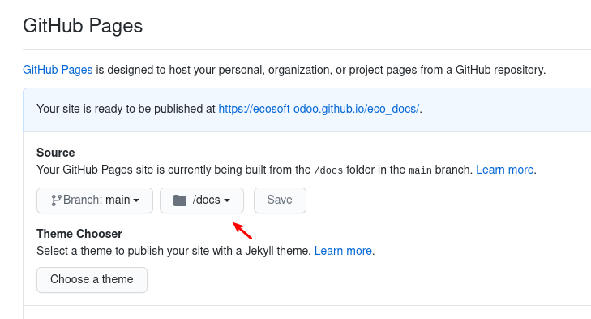

# Ecosoft Documentation Template

This template is based https://www.sphinx-doc.org with slides extension from https://github.com/nyergler/hieroglyph.

The template can be used as guideline in building documentation for projects, which will provide following benefits,

* Based on `.rst` format, which we are used to when working with github README.
* Sphinx-doc provide write once, output many format, i.e., html, slides, pdf (still problem with Thai), epub, etc.
* Sphinx-doc is also a widely used for opensource project, including Odoo. It is good to learn anyway. :)

**Note:** A good sample of .rst to follow -> https://github.com/kmee/oca-days-2020-odoo-developer/blob/docs/docs/index.rst

## Configuration

1. Install hieroglyph and sphinx-doc
    ```
    $ pip3 install hieroglyph
    ```
   **Note:** Hieroglyph supports Sphinx 2.4 and later, and Python 3.7 and later.
2. Copy `docs` into your $PROJECT folder
3. In your $PROJECT, `.gitignore`, make sure it has following ignore (it usually has)
    ```
    docs/_build/
    ```
4. Open file $PROJECT/docs/conf.py, edit your document's project information
    ```
    project = 'Your Project Name'
    author = 'Your Name / Your Team'
    version = '13.0.1.0.1'
    copyright = '2020, Ecosoft Co., Ltd.'
    ```

## Usage

Source documents are in folder $PROJECT/docs/source

* Document `index.rst` serves as table of content
* Document `manual_func.rst` and `manual_tech.rst` are sample documents, already included in `index.rst`
* By default, it set the TOC level to 3
```
Welcome to My Project Documentation
===================================

.. toctree::
   :maxdepth: 3
   :caption: Contents:

   manual_func
   manual_tech
```

To generate document in html and slides, into `docs/_build` folder 
```
$ cd docs
$ make html
$ make slides
```

As folder `_build` is in .gitignore and will not get pushed to your github project.
We have adjusted the `MakeFile`, with following section,
```
github:
	@make html
	@cp -a _build/html/. html
	@make slides
	@cp -a _build/slides/. slides
```

Instead, you can just call following command to output to `docs/html` and `docs/slides` folder.
```
$ cd docs
$ make github
```

## Host your document on github

Github allow you use github to how a webpage. To do so, go to project Settings > Options.

And enable Github Page, using docs folder as root.



Push content to github. And now you can access them from,

* HTML: `https://ecosoft-odoo.github.io/$PROJECT/html`
* Slides: `https://ecosoft-odoo.github.io/$PROJECT/slides`
